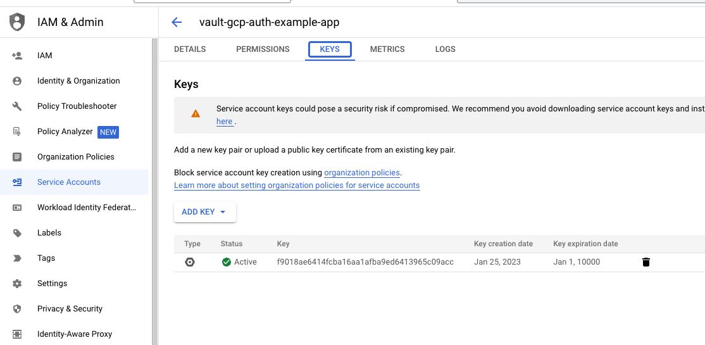

# Example Application to access Hashicorp Vault with GCP IAM authentication

# Introduction
In your Cloud environment its sometime necessary to handle sensitive data. A good approach is always to put the sensitive data to a key management system. 
Hashicorp Vault is a proper solution to handle those secrets.
This example shows how to integrate secrets from vault stored in a Key/Value Backend into your Spring Boot application.
The Integration is done with Spring Cloud Vault and for authentication a Google IAM method is used which is using a Google service account in combination with a JWT Authentication Flow

# Requirements

You have to install following things on your machine to get it working:

* Java 17 
* Apache Maven >= 3.8.X
* Access to GCP project and permission on it to create service accounts
* gcloud installed and initialized

# Getting Started

## Adjust access specific properties
To get access to Vault you first need some configurations on it. By following this tutorial, you'll get all information you need: https://confluence.otto.de/x/JwDLH

You'll get following information which have to be replaced inside bootstrap.yml

* Vault URL
* Vault Role Name
* your Service Account E-Mail to access Vault
* Secret Backend Name

With those information you can access Vault and put secrets to it. To read the right secrets you have to adjust in bootstrap.yml:
* default-context
* application-name

## Put in credentials.json
By default, the app is configured to read out a file called credentials.json which is places directly inside the classpath on root level.
In this file you need to add your service account key data in a json format.

To get the key you need to generate it, to generate it, just click the "Add Key" Button on google console and generate a json key.

Set the GOOGLE_APPLICATION_CREDENTIALS to the path of the json file.

`export GOOGLE_APPLICATION_CREDENTIALS=/path/to/your/json`

## Run the application
after putting in all the information you can start the app by typing:

`mvn spring-boot:run`

## Deploy to Cloud Run
Set up your local gcloud and set a project after that you can run following command to deploy it to Cloud Run

`gcloud run deploy --service-account=<YOUR_SERVICE_ACCOUNT_EMAIL>`

### Reference Documentation

For further reference, please consider the following sections:

* [Official Apache Maven documentation](https://maven.apache.org/guides/index.html)
* [Spring Boot Maven Plugin Reference Guide](https://docs.spring.io/spring-boot/docs/3.0.2/maven-plugin/reference/html/)
* [Create an OCI image](https://docs.spring.io/spring-boot/docs/3.0.2/maven-plugin/reference/html/#build-image)
* [Vault Client Quick Start](https://docs.spring.io/spring-cloud-vault/docs/current/reference/html/#client-side-usage)

